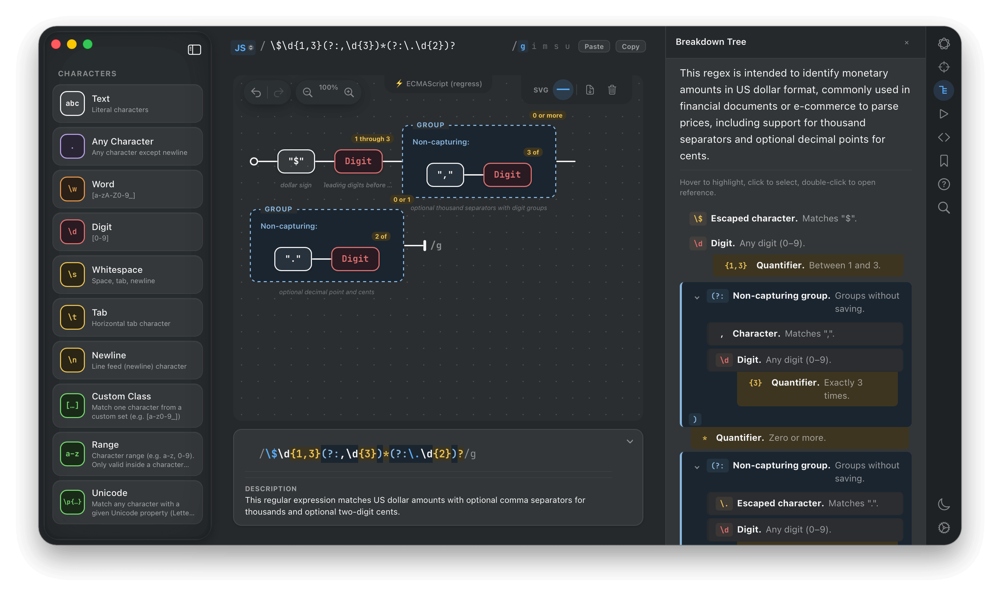

# Homebrew Tap for RegexPilot




```bash
brew tap Kristofp/homebrew-regexpilot
brew install --cask regexpilot
```

[RegexPilot](https://regexpilot.com) is a visual regex builder for macOS that runs patterns against real language engines — CPython, MRI Ruby, GraalVM, .NET, PCRE PHP, system Perl, system Swift — instead of approximating via JavaScript. 21 flavors, AI-assisted, AST-driven editor, works offline.

## Requirements

- macOS 14 (Sonoma) or later
- Apple Silicon or Intel (universal binary)

## Version

This tap tracks stable releases. For the latest beta, download directly from [regexpilot.com](https://regexpilot.com).
